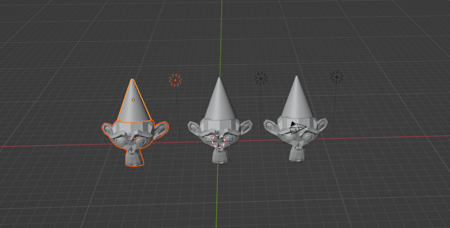
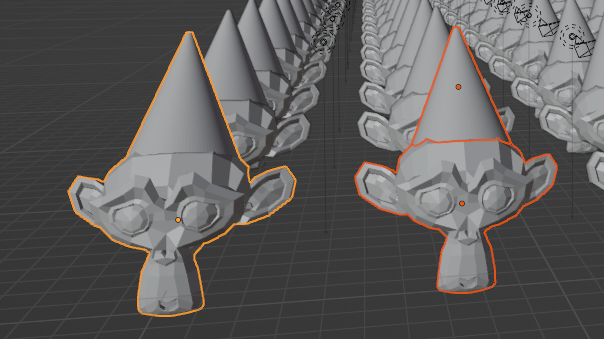

### Blender:
- By default Blender have some add-on  (Edit > Preferences > Add-ons) and extra have to added on are: 
    - Mesh LoopTools
    - Node: Node Wrangler
    - UV: TexTools 
        - download zip file from [link](https://github.com/franMarz/TexTools-Blender/releases/tag/v1.6.1)
        - keep the zip folder where you want.
        - In add-on part, on right top, there is an option **install**. Click it and give the path of that zip file.
        - It will get reflect in the Add-ons.
        - Always maintain that folder in that path as Render looks into that path.
- **New project**:
    - While opening Blender, you will get an modal box:
        - left side: new project options where General have all the other project features
        - right side: recent projects
- 3D info:
    - An object can be perceived as an object. Here:
        - X-axis: left and right side of an object.
        - Y-axis: forward and backward side of an object.
        - X-axis: up and down side of an object.
- **Pop-out Panel**
    - Press **n** from keyboard to toggle.
    - It will have tabs viz. : 
        - Item
        - Tool
        - View
        - Any other add-ons
- **Toolbar**
    - Press **t** from keyboard to toggle.
    - By default it contains some transform and selection tools.
    - Since it is context sensitive, options will change.
- View by using mouse or mouse panel:
    - With ctrl key: to rotate
    - With shift key: to move 
- **Orthographic View**
    - It basically takes the view of our 3D model and flattens it out without perspective.
    - It is mostly handy when you are modelling something and you want to view it from the front side or back side.
    - To view front side of the model, press **1**.
    - To view right side of the model, press **3**.
    - To view top side of the model, press **7**.
    - To view bottom side of the model, press **9**.
    - with ctrl and 
        - To view back side of the model, press **1**.
        - To view left side of the model, press **3**.
        - To view bottom side of the model, press **7**.
        - To view bottom side of the model, press **9**.
    - Navigation:  View (below Menu Bar) > Viewpoint > All the above options
- **Outliner Panel**:
    - It contains outliners with Camera, cube and light.
    - It has options to hide and unhide.
    - Shortcuts:
        - Click **h** to hide by highlighting by clicking on it.
        - Clicking **alt+h** will unhide all the hidden things.
        - To unhide only particular hidden item, use Eye icon in outliner panel.
- **Properties Panel**
    - It exists just below the properties panel and it contains the properties of the object.
- **Animation panel**:
    - It exits bottom of the App, clicking play button we can play the animation.
    - By default, it has 24 frames/sec (fps).
    - We can change by Properties Panel > Output tab > Frame rate drop-down
- **Multiple panels**:
    - Go to the **top left** side of the panel and there cursor becomes into **+** and drag to get new panel.
    - How to close the duplicate panels:
        - Again go to the **top left** side of the panel and drag towards the other panels and release the cursor.


#### Mesh Modeling:
- ##### Add and Transforming Mesh Objects:
    - **Grabbing**:
        - click the mesh object and click **g** and move and place the location where you want that mess. (Right click is used to move the mesh to previous location)
    - **Rotating**:
        - click the mesh object and click **r** and move and rotate the the mess. (Right click is used to move the mesh to previous rotation)
    - **Scaling**:
        - click the mesh object and click **s** and move and rotate the the mess. (Right click is used to move the mesh to previous rotation)
            - click s and after clicking x and move the move, it will get scale in x-axis
            - click s and after clicking y and move the move, it will get scale in y-axis
            - click s and after clicking z and move the move, it will get scale in z-axis
    - Note: 
        - this clciking x, y and z will work for all transform operations viz., grabbing and rotation also.
        - If I don't want to rotate or grab or scaling in particular direction, press **shift** key and then that direction key.
            - Ex: I don't want to rotate in x-axis, then:
                - click **r** and then **shift + x** and now rotate.
    - Global and Local references:
        - With reference to origin, X, Y and Z axis are displayed and they are called as Global.
        - With reference to mesh object itself, X, Y and Z axis are displayed and they are called as local.
        - To change this, on top of the scene, there is an dropdown.
        - I want to scale an mesh object which is 45 deg to Y-axis, then:
            - globally: s + y
            - locally: s + y + y
        Note: Works for all transform operations.
    - How to reset:
        - click the object and press:
            - alt + g : to reset grabbinng 
            - alt + s : to reset scaling 
            - alt + r : to reset rotation 
    - **Adding New Object**
        - ```shift + a``` opens a context menu with mesh primitives and select as per your requirement.
        - Any mesh that you add to a scene from this menu is called a **Mesh Primitive** i.e. they have a basic shape. 
        - Same menu can be accessed by **Add** ===> **Context Menu**
        -  **3D Cursor**:
            - it is the place where new objects adds.
            - How to change its position:
                - ```shift (in view port) + right click``` where you want to move its position.
                - to reset the 3D cursor or to change the view to origin:
                    - ```shift + c```
    - **Duplicate the objects**:
        - select the objects which you want
        - ```shift + d``` and drag the object to get duplicate item.
        - Duplicating along the particular axis:
            - ```shift + d``` and release and press the axis you want and drag it to get duplicate along that.
            
    - **rename a object**:
        - on right side panel, you can rename
        - click on the object and press **f2** and you will get an option to rename.
    - **delete an object**
        - select an object to delete and press delete
        - select an object, press x and d to delete
    - **select multiple objects**
        - drag and select [or]
        - shift and press the objects to select.
    - **joining objects**
        - select the objects which you want to join and press ```ctrl + j ```.
        - in the below image: I have selected and hat and suzanne in right side and pressed ```ctrl + j``` and result is like the left side image.
        
    


